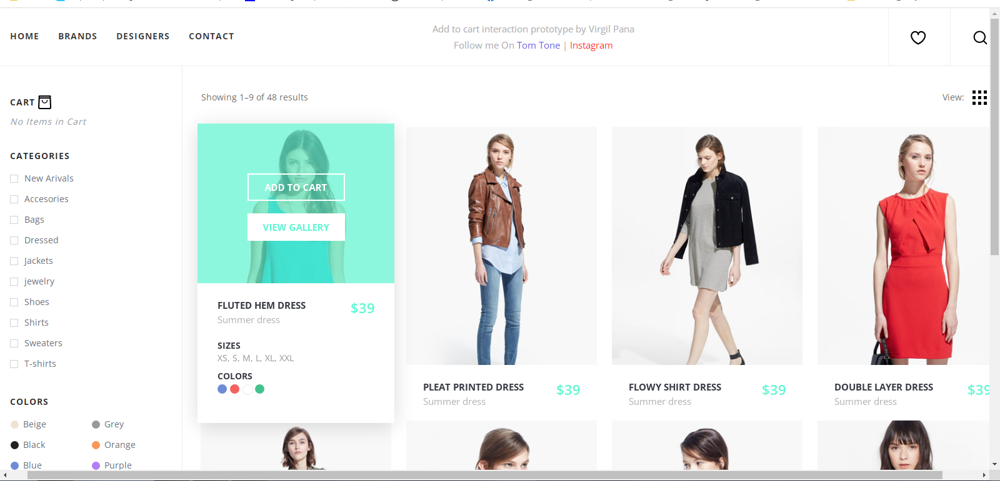

<h1 align="center"> SHopping Cart </h1>

Programa de Uso Livre Desenvolvido Por Virgil Pana e Cedido no Site CodeHim   

  <a href="#-tecnologias">Tecnologias</a>&nbsp;&nbsp;&nbsp;|&nbsp;&nbsp;&nbsp;
  <a href="#-projeto">Projeto</a>&nbsp;&nbsp;&nbsp;|&nbsp;&nbsp;&nbsp;
  <a href="#-layout">Layout</a>&nbsp;&nbsp;&nbsp;|&nbsp;&nbsp;&nbsp;
  <a href="#memo-licença">Licença</a>

 

  

## 🚀 Tecnologias

Esse projeto foi desenvolvido com as seguintes tecnologias:

- HTML e CSS
- JavaScript
- Git e Github
- JQuery

## 💻 Projeto

O Shopping Cart é um Programa desenvolvivo por Virgil Pana e liberado para Uso no site CodeHim, utilizei para estudo do sistema de Carrinho de Compras e animações de imagens e JQuery

## 🔖 Layout

Você pode visualizar o layout do projeto através [DESSE LINK](https://www.codehim.com/demo/single-page-shopping-cart-template/). 

## 📝 Licença

Esse projeto está liberado para personalização e uso pelo site CodeHim.

---

Feito com ♥ by Wellington Sato 👋